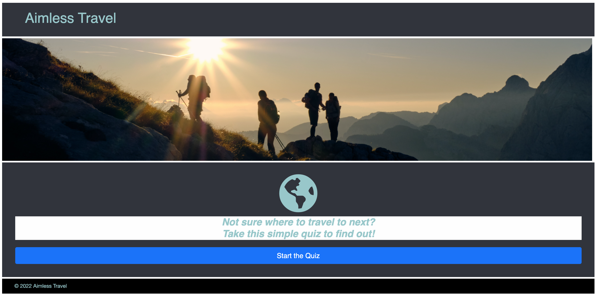

# Aimless Travel

### The app that can help you choose your next travel destination!

## Deployed application:

## Table of Contents
* [Technologies used](#technologies-used)
* [Features](#features)
* [Known bugs](#known-bugs)
* [Images](#stock-image-provided-by)
* [License](#license)
* [Contributors](#contributors)
* [Questions](#questions)

## Technologies Used
* HTML
* CSS
* JavaScript
* Bootstrap
* Handlebars
* Node packages used: sequelize, express, express-session, express-handlebars, dotenv, path, dotenv, connect-session-sequelize, mysql2, bcrypt

## Features
* Go to [insert web link here] and click "Start the Quiz". 
* After that you will be asked to login or sign up. Your password is protected as you're typing it in.
*  Just answer the questions based on your interest, and we will choose your next travel destination

## Known Bugs
None found.

## Image provided by:
* [Pixabay.com](https://www.ncei.noaa.gov/news/weather-vs-climate)
* [@lvnatikk](https://unsplash.com/photos/-YHSwy6uqvk)
* [Regina Vaicekonyte](https://delos.com/resources/blog/travel-during-covid-19-exposure-risk-on-different-modes-of-transportation/)
* [@wriopomba](https://unsplash.com/photos/Kmqog-irt-k)
* [@srcharls](https://unsplash.com/photos/wt3disORDAg)
* [@jezar](https://unsplash.com/photos/alY6_OpdwRQ)
* [@rrebba](https://unsplash.com/photos/zunQwMy5B6M)
* [@joey_csunyo](https://unsplash.com/photos/NwGMe-NuDm0)
* [Kristjan Kotar](https://unsplash.com/photos/-h15p84GY5k)

## License
This project is licensed under the MIT license.

## Contributors
* Stephen Dickey [@StephenWDickey](https://github.com/StephenWDickey)
* Ellyse Carter [@ellysecarter](https://github.com/ellysecarter)
* Rotimi Amao [@Rotimi-28](https://github.com/Rotimi-28)

## Questions?
If you have any questions about the project, contact any of the contributors above. 